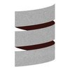

Author Pablo Perez Garcia

Is this repo useful? Please ⭑Star this repository and share the love.

# 

Here we cover with some practical examples, the most common use of Scala API.

* **[Collections](scala_features/src/main/scala/app/impl/scala/Collections.scala)**
* **[Algorithmic](scala_features/src/main/scala/app/impl/scala/Algorithmic.scala)**
* **[Implicit](scala_features/src/main/scala/app/impl/scala/Implicit.scala)**
* **[Pattern matching](scala_features/src/main/scala/app/impl/scala/PatternMatchingFeature.scala)**
* **[For Comprenhensions](scala_features/src/main/scala/app/impl/scala/ForComprenhensions.scala)**
* **[Type Classes](scala_features/src/main/scala/app/impl/scala/TypeClasses.scala)**
* **[Interpolation](scala_features/src/main/scala/app/impl/scala/Interpolation.scala)**
* **[Future](scala_features/src/main/scala/app/impl/scala/FutureFeatures.scala)**
* **[Functions](scala_features/src/main/scala/app/impl/scala/Functions.scala)**
* **[Factory](scala_features/src/main/scala/app/impl/scala/Factory.scala)**
* **[Compound Types](scala_features/src/main/scala/app/impl/scala/CompoundTypes.scala)**
* **[Self Reference](scala_features/src/main/scala/app/impl/scala/SelfReference.scala)**
* **[Generics](scala_features/src/main/scala/app/impl/scala/Generics.scala)**
* **[Covariant SubType](scala_features/src/main/scala/app/impl/scala/CovariantSubType.scala)**
* **[Partial function](scala_features/src/main/scala/app/impl/scala/PartialFunctions.scala)**
* **[Extractor](scala_features/src/main/scala/app/impl/scala/Extractor.scala)**
* **[Try](scala_features/src/main/scala/app/impl/scala/Try.scala)**
* **[Either](scala_features/src/main/scala/app/impl/scala/EitherFeature.scala)**
* **[Fold](scala_features/src/main/scala/app/impl/scala/FoldFunction.scala)**
* **[Currying](scala_features/src/main/scala/app/impl/scala/Currying.scala)**
* **[Utils](scala_features/src/main/scala/app/impl/scala/Utils.scala)**
* **[Reflection](scala_features/src/main/scala/app/impl/scala/ReflectionFeature.scala)**
* **[Phantom Types](scala_features/src/main/scala/app/impl/scala/PhantomTypes.scala)**
* **[Option](scala_features/src/main/scala/app/impl/scala/OptionFeature.scala)**

# Scala 

Here we cover with some practical examples, the new features of the version 3 

* **[Given instances](https://github.com/politrons/scala3Features/blob/master/src/main/scala/scala/features/GivenInstancesFeatures.scala)**
* **[Implicit functions](https://github.com/politrons/scala3Features/blob/master/src/main/scala/scala/features/ImplicitFunctionFeature.scala)**
* **[Intersection types](https://github.com/politrons/scala3Features/blob/master/src/main/scala/scala/features/IntersectionTypesFeature.scala)**
* **[Union types](https://github.com/politrons/scala3Features/blob/master/src/main/scala/scala/features/UnionTypesFeature.scala)**
* **[Enum types](https://github.com/politrons/scala3Features/blob/master/src/main/scala/scala/features/EnumTypesFeatures.scala)**
* **[Type Lambda](https://github.com/politrons/scala3Features/blob/master/src/main/scala/scala/features/TypeLambdaFeature.scala)**
* **[Trait Params](https://github.com/politrons/scala3Features/blob/master/src/main/scala/scala/features/TraitParamsFeature.scala)**
* **[Extension methods](https://github.com/politrons/scala3Features/blob/master/src/main/scala/scala/features/ExtensionMethodsFeature.scala)**
* **[Export Clauses](https://github.com/politrons/scala3Features/blob/master/src/main/scala/scala/features/ExportClausesFeature.scala)**
* **[Auto param tuples](https://github.com/politrons/scala3Features/blob/master/src/main/scala/scala/features/AutoParamTuplingFeature.scala)**
* **[Multiverse equality](https://github.com/politrons/scala3Features/blob/master/src/main/scala/scala/features/MultiversalEqualityFeature.scala)**
* **[Pattern matching](https://github.com/politrons/scala3Features/blob/master/src/main/scala/scala/features/PatternMatchingFeature.scala)**
* **[Inline](https://github.com/politrons/scala3Features/blob/master/src/main/scala/scala/features/InlineFeature.scala)**
* **[Structure & Style](https://github.com/politrons/scala3Features/blob/master/src/main/scala/scala/features/StructureStyleFeature.scala)**

# 

Here we cover with some practical examples, the most common use of the ReactiveX platform for Scala.

RxJava examples [here](https://github.com/politrons/reactive)

* **[Combining](scala_features/src/main/scala/app/impl/rx/Combining.scala)**
* **[Creating](scala_features/src/main/scala/app/impl/rx/Creating.scala)**
* **[Filtering](scala_features/src/main/scala/app/impl/rx/Filtering.scala)**
* **[Transforming](scala_features/src/main/scala/app/impl/rx/Transforming.scala)**
* **[Scheduler](scala_features/src/main/scala/app/impl/rx/Scheduler.scala)**
* **[Implicit](scala_features/src/main/scala/app/impl/rx/ImplicitObservables.scala)**

# ScalaZ
ScalaZ Principled Functional Programming in Scala.

Here we cover with some practical examples, the most common use of ScalaZ API.

* **[Functor](scala_features/src/main/scala/app/impl/scalaz/FunctorFeature.scala)**
* **[Monad laws](scala_features/src/main/scala/app/impl/scalaz/MonadLaws.scala)**
* **[Free monads](scala_features/src/main/scala/app/impl/scalaz/FreeMonad.scala)**
* **[Writer monad](scala_features/src/main/scala/app/impl/scalaz/WriterMonad.scala)**
* **[Reader monad](scala_features/src/main/scala/app/impl/scalaz/ReaderMonad.scala)**
* **[State monad](scala_features/src/main/scala/app/impl/scalaz/StateMonad.scala)**
* **[IO Effects monad](scala_features/src/main/scala/app/impl/scalaz/io/IOMonad.scala)**
* **[Monad transformer](scala_features/src/main/scala/app/impl/scalaz/MonadTransformer.scala)**
* **[EitherT](scala_features/src/main/scala/app/impl/scalaz/EitherTMonadTransformer.scala)**
* **[OptionT](scala_features/src/main/scala/app/impl/scalaz/OptionTMonadTransformer.scala)**
* **[Features](scala_features/src/main/scala/app/impl/scalaz/Features.scala)**
* **[Tagging](scala_features/src/main/scala/app/impl/scalaz/Tagging.scala)**
* **[Test DSL](scala_features/src/main/scala/app/impl/scalaz/TestDSL.scala)**
* **[Lens](scala_features/src/main/scala/app/impl/scalaz/LensFeature.scala)**
* **[Category theory](scala_features/src/main/scala/app/impl/scalaz/CategoryTheory.scala)**

# ZIO

ZIO A type-safe, composable library for asynchronous and concurrent programming in Scala.

Here we cover with some practical examples, the most common use of ZIO library.

* **[ZIO monad](scala_features/src/main/scala/app/impl/zio/ZIOMonad.scala)**
* **[ZIO Actor](scala_features/src/main/scala/app/impl/zio/ZIOActor.scala)**
* **[ZIO ZLayer](scala_features/src/main/scala/app/impl/zio/ZIOLayer.scala)**
* **[ZIO ZStream](scala_features/src/main/scala/app/impl/zio/ZIOZStream.scala)**
* **[ZIO Config](scala_features/src/main/scala/app/impl/zio/ZIOConfigFeature.scala)**
* **[ZIO Test](scala_features/src/main/scala/app/impl/zio/ZIOTestFeature.scala)**
* **[ZIO flip](scala_features/src/main/scala/app/impl/zio/ZIOFlip.scala)**
* **[ZIO queue](scala_features/src/main/scala/app/impl/zio/ZIOQueue.scala)**
* **[ZIO fiber](scala_features/src/main/scala/app/impl/zio/ZIOFiber.scala)**

# Scala-native

Scala Native is an optimizing ahead-of-time compiler and lightweight managed runtime designed specifically for Scala.

Here we cover some of the most important features of the library with practical examples.

* **[Features](https://github.com/politrons/scala-native/blob/master/src/main/scala/com/politrons/server/Features.scala)**

Documentation of how to configure a scala-native project [here](https://github.com/politrons/scala-native)

# 

Shapeless is a type class and dependent type based generic programming library for Scala.

Here we cover some of the most important features of the library with practical examples.

* **[Generics](scala_features/src/main/scala/app/impl/shapeless/Generic.scala)**
* **[HList](scala_features/src/main/scala/app/impl/shapeless/HListUtils.scala)**
* **[Tags](scala_features/src/main/scala/app/impl/shapeless/TagsFeature.scala)**
* **[Tuples](scala_features/src/main/scala/app/impl/shapeless/TuplesExtension.scala)**
* **[HMap](scala_features/src/main/scala/app/impl/shapeless/HMapFeature.scala)**
* **[Coproduct](scala_features/src/main/scala/app/impl/shapeless/CoproductFeature.scala)**

# Monix

Monix is a high-performance Scala library for Reactive programing, composing asynchronous and event-based programs.

Here we cover some of the most important features of the library with practical examples.

The original project [here](https://monix.io/)

* **[Consumers](monix/src/main/scala/com/politrons/monix/TaskConsumers.scala)**
* **[Creation](monix/src/main/scala/com/politrons/monix/TaskCreation.scala)**
* **[Task Error handler](monix/src/main/scala/com/politrons/monix/TaskErrorHandler.scala)**
* **[Observable](monix/src/main/scala/com/politrons/monix/ObservableFeature.scala)**
* **[Circuit breaker](monix/src/main/scala/com/politrons/monix/CircuitBreakerFeature.scala)**

# Category Theory

* **[Monoid](category_theory/src/main/scala/types/MonoidFeature.scala)**
* **[Functor](category_theory/src/main/scala/types/FunctorFeature.scala)**
* **[Applicative](category_theory/src/main/scala/types/ApplicativeFeature.scala)**
* **[Monoidal](category_theory/src/main/scala/types/MonoidalFeature.scala)**
* **[Monad](category_theory/src/main/scala/types/MonadFeature.scala)**

# Fs2

* **[Stream feature](fs2/src/main/scala/StreamFeature.scala)**

# Finagle

* **[Http Client](scala_features/src/main/scala/app/impl/finagle/HttpClient.scala)**
* **[Http Server](scala_features/src/main/scala/app/impl/finagle/HttpServers.scala)**
* **[Service](scala_features/src/main/scala/app/impl/finagle/FinagleService.scala)**
* **[Filter](scala_features/src/main/scala/app/impl/finagle/TimeoutFilter.scala)**

# Go features

Examples of some ported features of [Golang](https://golang.org/) in scala.

* **[Go routine & Channel](scala_features/src/main/scala/app/impl/go/GoRoutineAndChannel.scala)**

# Design patterns

* **[Creational](scala_features/src/main/scala/app/impl/patterns/creational)**
* **[Structural](scala_features/src/main/scala/app/impl/patterns/structural)**
* **[Behavioral](scala_features/src/main/scala/app/impl/patterns/behavioral)**
* **[Cake pattern](scala_features/src/main/scala/app/impl/patterns/di/CakePattern.scala)**
* **[DI Implicit](scala_features/src/main/scala/app/impl/patterns/di/Main.scala)**

# Haskell style

Examples of how Scala and Haskell can look alike.

* **[ScalaHaskell](scala_features/src/main/scala/app/impl/haskell/ScalaHaskell.scala)**

 

# gRPC + ZIO

Example of Client and Server using gRPC with ZIO and ZLayers for dependency injection.

* **[Client](zio/src/main/scala/com/features/grpc/ZIOgRPCClient.scala)**
* **[Server](zio/src/main/scala/com/features/grpc/ZIOgRPCServer.scala)**

# Hedged Http client

Hedged requests: send the same requests to multiple servers, and use whatever response comes back first.

* **[Connector](scala_features/src/main/scala/app/impl/http/HttpHedgedClient.scala)**
* **[DSL Runner](scala_features/src/main/scala/app/impl/http/HedgedClientRunner.scala)**

# Tagless Final

Examples of use Tagless Final encode to enjoy the potential of free structures.

* **[Tagless](scala_features/src/main/scala/app/impl/tagless/TagLessFeature.scala)**

# Macros

* [DSL validator](macros/src/main/scala/app/impl/macros/::.scala)
* [Runner](test_macros/src/main/scala/app/impl/macros/Main.scala)

# Refined

Examples of this library to validate values types in compilation time.

* [Examples](scala_features/src/main/scala/app/impl/types/RefinedFeature.scala)

# Algorithms

* **[Sorting](scala_features/src/main/scala/app/impl/algorithms/SortAlgorithm.scala)**
* **[String](scala_features/src/main/scala/app/impl/algorithms/StringAlgorithm.scala)**
* **[Logic](scala_features/src/main/scala/app/impl/algorithms/LogicAlgorithm.scala)**

# Data structure

* **[Array](scala_features/src/main/scala/app/impl/algorithms/ArrayDS.scala)**
* **[LinkedList](scala_features/src/main/scala/app/impl/algorithms/LinkedListDS.scala)**
* **[Tree](scala_features/src/main/scala/app/impl/algorithms/TreeDS.scala)**
* **[Graph](scala_features/src/main/scala/app/impl/algorithms/GraphsTheory.scala)**
* **[Stack](scala_features/src/main/scala/app/impl/algorithms/StackDS.scala)**

# Dotty

* **[Implicit function types](scala_features/src/main/scala/app/impl/scala3/ImplicitFunctionTypes.scala)**